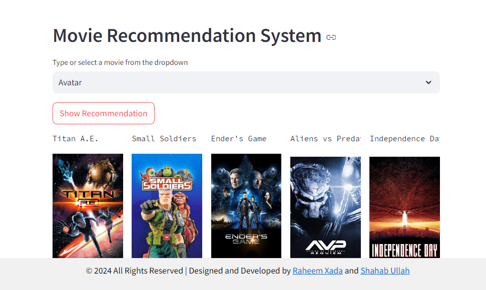

# Hi, I'm Muhammad Raheem Xada! 👋


## 🔗 Links
[](https://raheemxada.netlify.app/)
[](https://www.linkedin.com/in/raheemxada41/)
[](https://medium.com/@raheemxada41)


## 🚀 About Me
I'm Muhammad Raheem Xada, a dedicated Software Engineering student with a strong passion for Data Analytics, Data Science, and Machine Learning.


# Movie Recommendation System Using Machine Learning

This project is a Movie Recommendation System that uses Content-based filtering to recommend movies to users. By analyzing the content and features of movies, such as genres, cast, and keywords, the system can suggest movies that are similar to a given movie. This approach leverages the similarity between movie attributes to provide recommendations. The system is developed using Python, Pandas, Scikit-Learn, Streamlit, and Jupyter Notebook.




## Table of Contents

- [Installation](#installation)
- [Usage](#usage)
- [Contributing](#contributing)
- [Contact](#contact)
- [License](#license)

## Installation

1. **Clone the repository:**
    ```bash
    git clone https://github.com/Coding-Scorpion/Movie-Recommendation-System-Using-Machine-Learning.git
    cd Movie-Recommendation-System-Using-Machine-Learning
    ```

2. **Download the dataset:**
   Download the [TMDB 5000 Movie Dataset](https://www.kaggle.com/tmdb/tmdb-movie-metadata) and place it in the project directory folder.

3. **Download the required pickle files:**
   Download the pickle files from the following links and place them in the project directory folder:
    - [movie_list.pkl](https://drive.google.com/file/d/1IjNFDEGsFES7M_WgX2UHhYJJTDR7l1DK/view?usp=drive_link)
    - [similarity.pkl](https://drive.google.com/file/d/12ZYX27bNVloUkzszRDg8bCVM7gTiYDdn/view?usp=drive_link)

4. **Install the required libraries:**
    ```bash
    pip install -r requirements.txt
    ```

## Usage

To use the Movie Recommendation System, follow the steps below:

1. Open a terminal or command prompt.
2. Navigate to the project directory.
3. Run the Streamlit app:
    ```bash
    streamlit run app.py
    ```

The app will open in your default web browser, and you can start using the movie recommendation system.

## Contributing

Contributions are welcome! Feel free to open an issue or submit a pull request if you have any ideas, suggestions, or problems.

## Contact

For any inquiries or questions, please contact the authors:
- Muhammad Raheem Zada: raheemzada385@gmail.com
- Shahabullah: shahabullah990@gmail.com

## License
[](https://choosealicense.com/licenses/mit/)
This project is licensed under the MIT License.

